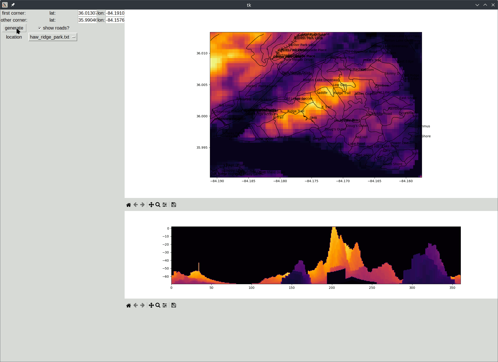

# MountainViewer
queries SRTM and OSM data, generates topo maps, uses ray-tracing to calculate the view from a given location. This is just a pet project, because i'm always asking "what mountain is that over there?", and i want to generate high-res topo maps for ADV motorcycling route planning. 

Enter your lat/lon corner coordinates, or choose from a pre-defined area (or build your own in the named_areas folder)

click the topo map (top panel, drops a red pin) to generate the view from that location (bottom panel)

click the ground view (bottom panel) to calculate where that point is on the topo map (drops a green pin on the top panel)

